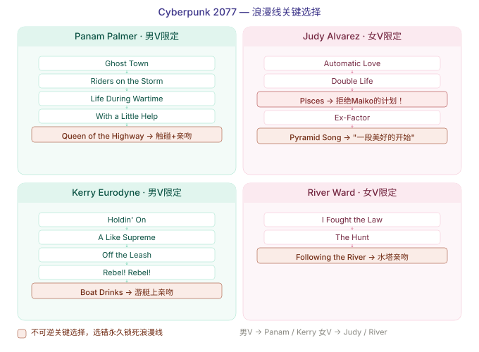

# 赛博朋克2077 — 浪漫攻略

> 在夜之城，除了战斗，还有爱情。

## 帕南·帕尔默（男 V 限定）

**性别要求**：男性 V（男性体型，任意声音）

**任务线**：Ghost Town → Lightning Breaks → Life During Wartime → Riders on the Storm → With a Little Help from My Friends → Queen of the Highway

**关键选项**：
1. 在"公路之歌"任务中，支持她对抗纳什
2. 在酒吧谈心时表达对她的关心
3. 在魔蜥上触摸她的腿（⚠️ 关键选项！）
4. 最终任务中不要拒绝她的身体接触

**浪漫触发**：完成"Queen of the Highway"后在营地篝火旁

> 💡 帕南是唯一会加入最终战的伴侣，实用度最高。

---

## 朱迪·阿尔瓦雷兹（女 V 限定）

**性别要求**：女性 V（女性体型 + 女性声音）

**任务线**：Automatic Love → The Space in Between → Disasterpiece → Double Life → Both Sides, Now → Ex-Factor → Talkin' 'bout a Revolution → Pisces → Pyramid Song

**关键选项**：

### Pisces 任务中的致命陷阱 ⚠️
在 Pisces 任务中，你需要面对舞子（Maiko）的计划：

| 你的选择 | 结果 |
|---------|------|
| 拒绝舞子的计划（和朱迪站在一起战斗） | ✅ 浪漫线继续 |
| 接受舞子的计划，但**拒绝**她的钱 | ✅ 浪漫线继续 |
| 接受舞子的计划 **且接受**她的钱 | ❌ 浪漫线**永久终止** |

> 🔴 **如果接受舞子的钱，朱迪会离开夜之城并将你删除联系人 — 不可逆转！**

### Pyramid Song 中的关键选择
1. 在"金字塔之歌"中和朱迪一起潜水
2. 在小屋里度过一夜
3. **次日早晨在码头** — 选择 "这是个美好的开始"（The beginning of something amazing）正式确立关系

**浪漫触发**：完成"Pyramid Song"后在湖边小屋 / 码头

> 💡 浪漫在 Pyramid Song 的码头对话中正式触发，不是在 Pisces 期间。但 Pisces 的选择决定了是否能看到 Pyramid Song。

---

## 大河·沃德（女 V 限定）

**性别要求**：女性 V（女性体型，任意声音）

**任务线**：I Fought the Law → The Hunt → Following the River

**关键选项**：
1. 在"The Hunt"任务中支持大河
2. 家庭聚餐时表达关心
3. 在他表白的屋顶上接受他

> River 的任务线是四个角色中最短的（仅 3 个支线任务）。

---

## 克里·欧罗迪恩（男 V 限定）

**性别要求**：男性 V（男性体型 + 男性声音）

**任务线**：Holdin' On → Second Conflict → A Like Supreme → Rebel! Rebel! → I Don't Wanna Hear It → **Off the Leash** → Boat Drinks

**关键选项**：
1. 帮克里解决"Rebel! Rebel!"的演出问题
2. 在 **Off the Leash** 任务中（Dark Matter 夜总会露台），首次有机会亲吻克里
3. 在游艇上接受他的吻（Boat Drinks 中正式确认关系）

---

## 速查表

| 角色 | 性别要求 | 任务数量 | 实用度 |
|------|----------|---------|--------|
| 帕南（Panam） | 男 V | 6（3 主线 + 3 支线） | ★★★★★ |
| 朱迪（Judy） | 女 V | 10（5 主线 + 5 支线） | ★★★ |
| 克里（Kerry） | 男 V | 7 支线 | ★★★ |
| 大河（River） | 女 V | 3 支线 | ★★ |

> ⚠️ 性别锁定严格：帕南和克里需要**男 V**，朱迪和大河需要**女 V**。一旦进入浪漫关系就不可逆转，选前想清楚。
