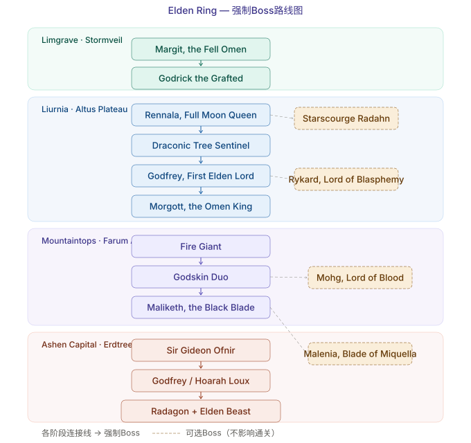

# 艾尔登法环 — BOSS 攻略

> 从新手村到最终 Boss，手把手拆解每一场战斗

## 前期 Boss

### "恶兆" 玛尔基特
- **位置**：史东薇尔城门前
- **难度**：★★★★☆（对新手）
- **推荐等级**：20-25
- **弱点**：出血、弹反
- **打法**：
  - 招罗杰尔 + 离群野狼，三打一
  - 光剑三连：滚→滚→向后滚
  - 跳劈落地有 2 秒硬直，是输出窗口
  - 半血进 P2，增加锤子连段

### "接肢" 葛瑞克
- **位置**：史东薇尔城顶
- **难度**：★★★☆☆
- **推荐等级**：30-35
- **打法**：召唤涅斐丽，绕后打手。P2 龙头的火焰攻击低头即可躲避。

## 中期 Boss

### 拉达冈的红狼（Red Wolf of Radagon）
- **位置**：魔法学院（蕾娜菈门前）
- **难度**：★★★☆☆
- 机动性极强，会释放魔法飞剑和范围火焰，保持中距离
- **弱点**：失衡值低，重武器几下就能打出致命一击

### "满月女王" 蕾娜菈（Rennala）
- **位置**：魔法学院
- **难度**：★★★☆☆
- **P1**：打发光的小女孩，物理伤害无效（用法术或普攻破盾）
- **P2**：满月女王亲自出手，法术为主，拉开距离或用法术护盾

### "碎星" 拉塔恩（Radahn）※ 可选
- **难度**：★★★★★
- **位置**：红狮子城
- **史诗级 Boss 战**，可召唤 6 个 NPC
- 弱猩红腐败，保持骑马机动
- **关键**：进 P2 的陨石天降——上马狂奔！

### "鲜血君王" 蒙格（Mohg）※ 可选
- **难度**：★★★★☆
- **位置**：蒙格温王朝
- **必带**：净血结晶露（抵消三次鲜血诅咒）
- **打法**：中了诅咒不要慌，喝药即可

## 后期 Boss（强制路线）

### 龙装大树守卫（Draconic Tree Sentinel）
- **位置**：王城罗德尔入口
- **难度**：★★★★☆
- 击败后才能进入王城。骑马绕圈磨血是最稳打法。

### "初始之王" 葛孚雷（幻影）（Godfrey, Golden Shade）
- **位置**：王城罗德尔
- **难度**：★★★★☆
- 幻影版葛孚雷，招式大开大合，回避后可反击

### "恶兆王" 蒙葛特（Morgott）
- **位置**：王城罗德尔王座
- **难度**：★★★★☆
- 玛尔基特的完全体，多了圣属性飞剑和范围技，可用蒙葛特的囚具

### 火焰巨人（Fire Giant）
- **位置**：巨人山顶
- **难度**：★★★★☆
- 使用 Torrent 骑马绕后攻击脚踝，P2 攻击手腕和眼睛

### 神皮双人组（Godskin Duo）
- **位置**：崩坏的法则姆·阿兹拉
- **难度**：★★★★★
- 强制连战，两个 Boss 共享血条。睡眠壶和骨灰召唤是关键

### "黑剑" 玛利喀斯（Maliketh）
- **难度**：★★★★★
- P1 野兽牧师，P2 拔出命定之死后极其狂暴
- **技巧**：亵渎兽爪可以弹反黑剑的特定招式

### "百智爵士" 基甸·奥夫尼尔（Sir Gideon Ofnir）
- **位置**：灰烬王城罗德尔
- **难度**：★★★☆☆
- 法术大杂烩，在他说话时直接近身爆发输出

### "初始之王" 葛孚雷 / 荷莱·露（Godfrey / Hoarah Loux）
- **位置**：灰烬王城罗德尔
- **难度**：★★★★★
- P1 斧头范围攻击，P2 变为赤手摔跤手，全程高节奏

### "大法官" 拉达冈 + 艾尔登之兽（Radagon + Elden Beast）
- **难度**：★★★★★
- 连战！拉达冈弱火，艾尔登之兽弱物理
- 建议圣属性防御堆满

## 隐藏 Boss

### "女武神" 玛莲妮亚
- **难度**：★★★★★★（全游戏最难）
- **位置**：圣树的底层
- **回血机制**：打中你就回血，召唤物被击中也给她回血
- **水鸟乱舞**：游戏最致命的连击，三阶段闪避节奏：滚远→前滚→后滚
- **推荐**：出血流 + 仿身泪滴 + 冰霜壶打断水鸟

> 💀 据统计，玛莲妮亚已击杀玩家超过 3 亿次。
