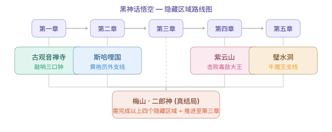

# Black Myth Wukong — Hidden Content & True Ending Guide

> The game has 5 secret areas (one per chapter). Complete all of them to unlock the true ending.

Most "secret area" pages just list entrances — but the trap in Black Myth Wukong is that the secret areas are *gated in a specific order*, and one of them (Mount Mei) silently depends on a Chapter 3 side quest most players blow past. Miss the Treasure Hunter quest and the Great Pagoda murals never fill in, which means no Erlang, which means no true ending — despite having cleared every other secret. Treat the five areas as a chain, not a checklist.

This guide does two things most others don't: it reproduces the exact entrance conditions and hidden-boss list from the 1.0 campaign, and — more importantly — it flags the *prerequisites and missable points* so you don't reach Chapter 6 and realize the true ending is already locked out. All locations below are from the in-game world layout; where a step is "required," it's required *for the true ending specifically*, not for finishing the story.

> **Beginner trap we see constantly:** players assume the Zodiac Village (Painted Realm) is the "sixth" secret area. It isn't. The true ending needs the 5 chapter secret areas *plus* the Chapter 3 Treasure Hunter quest. The Zodiac Village is a useful hub, but clearing it does nothing for the ending.

## True Ending — Unlock Conditions

**Prerequisites: Complete all 5 secret areas + Chapter 3 Treasure Hunter quest**

1. After completing all secret areas, go to the **Great Pagoda** in Chapter 3
2. Once all murals in the Great Pagoda are filled in, **Maitreya (弥勒佛)** appears
3. Speak with Maitreya to enter **Mount Mei (梅山)**
4. Defeat **Erlang, the Sacred Divinity (二郎神)**
5. Erlang transforms — the Destined One becomes a stone monkey and fights the **Four Heavenly Kings**
6. After the Four Heavenly Kings, Erlang transforms again into a giant beast form for the final showdown
7. Return to Chapter 6 and defeat the Stone Monkey + Great Sage's Broken Shell to trigger the **true ending**

**True Ending Rewards**: Unlocks the hidden ending cinematic, plus the Azure Dome transformation and Tri-Point Double-Edged Spear.

> **Our judgment:** the true ending is a *preparation* achievement, not a post-game one. By the time you're in Chapter 6, every gate is already decided. If your goal is the true ending, you must be thinking about the Treasure Hunter quest back in Chapter 3 — long before Mount Mei is ever mentioned. See our [boss guide](/en/wukong/boss-guide/) for the Erlang fight specifically.

---

## All 5 Secret Areas (by Chapter)

### Chapter 1: Ancient Guanyin Temple (古观音禅寺)

**How to enter**: Find and ring the **three bells** in the Forest of Wolves

| Bell | Location |
|------|----------|
| First | Guangzhi's arena |
| Second | Guangmou's arena |
| Third | Whiteclad Noble's arena |

Ringing the third bell teleports you to the Ancient Guanyin Temple. Hidden Boss: **Elder Jinchi**

> **Our call:** this is the most missable area for speedrunners — the bells are inside boss arenas you might skip past on a fast clear. Kill each wolf boss, then backtrack and ring the bell before leaving the zone.

### Chapter 2: Kingdom of Sahali (莎诃利国)

**How to enter**: Complete the **Drunken Boar** quest chain
- Find the Drunken Boar NPC near Yellow Wind Ridge
- Follow quest prompts to find a sobering item
- Complete the quest to unlock the Kingdom of Sahali secret area
- Hidden Boss: **Fuban (蝜蝂)**

### Chapter 3: Mount Mei (梅山)

**How to enter**: Via the Great Pagoda (requires completing the first 4 secret areas + Treasure Hunter quest)
- The Great Pagoda is located in Chapter 3
- Each completed secret area fills in part of the murals
- Once all murals are complete, Maitreya appears and guides you to Mount Mei
- Hidden Boss: **Erlang Shen (二郎神)** — the game's hardest boss

> This is the linchpin area. If any of the first four secret areas or the Treasure Hunter quest is incomplete, the murals stay blank and Maitreya never shows. There is no workaround — the chain is strict.

### Chapter 4: Purple Cloud Mountain (紫云山)

**How to enter**: Defeat **Venom Daoist (虫总兵)** twice in Chapter 4

| Encounter | Location |
|-----------|----------|
| First | Webbed Hollow / Pool of Shattered Jade |
| Second | Temple of the Yellow Flower / Court of Illumination |

After the second defeat, interact with the wall to enter Purple Cloud Mountain. Hidden Boss: **Duskveil (毒敌大王)**

> **Our take:** the "twice" detail is where players get stuck — they beat Venom Daoist once, see no prompt, and assume the area is bugged. You must progress far enough to re-encounter him in the second location, then interact with the wall afterward.

### Chapter 5: Bishui Cave (碧水洞)

**How to enter**: Complete the **Five-Element Carts (五行车)** quest chain
- Progress through the Five-Element Carts quests in the Flaming Mountain area
- Complete all carts to unlock the Bishui Cave entrance
- Hidden Boss: **Bishui Golden-Eyed Beast (避水金睛兽)**

---

## Zodiac Village (生肖村) — NPC Hub

The Zodiac Village (also known as the Painted Realm / 画中世界) is NOT a secret area, but it's essential:

**How to unlock**:
1. Find **Chen Loong (陈龙)** at the North Shore in Chapter 3
2. Defeat him, then get a Special Fortifying Pill from **Xu Dog (戌狗)**
3. Give the pill to Chen Loong to receive the **Ruyi Scroll (如意卷轴)**
4. Use the scroll to enter the Painted Realm / Zodiac Village

**Zodiac Village NPCs**:
| NPC | Function |
|-----|----------|
| Xu Dog (戌狗) | Medicine Crafting |
| Shen Monkey (申猴) | Gourd Upgrades |
| Chen Loong (陈龙) | Farming |
| Yin Tiger (寅虎) | Blacksmith / Armor Upgrades |

> **Our call:** the Zodiac Village's real value is Shen Monkey's [gourd](/en/wukong/gourds/) upgrades and Yin Tiger's blacksmith work — both pay off across every other build. It's worth unlocking early, even though it doesn't count toward the ending.

---

## Hidden Boss Summary

| Boss | Location | Notes |
|------|----------|-------|
| Elder Jinchi (金池长老) | Ch1 Ancient Guanyin Temple | Ring all three bells |
| Red Loong (赤髯龙) | Ch1 | Use Loong Scale to unlock waterfall |
| Black Loong (黑髯龙) | Ch2 | Use Loong Scale to unlock |
| Shigandang (石敢当) | Ch2 Fright Cliff | Collect 6 Buddha's Eyeballs to summon |
| Fuban (蝜蝂) | Ch2 Kingdom of Sahali | Complete Drunken Boar quest |
| Duskveil (毒敌大王) | Ch4 Purple Cloud Mountain | Defeat Venom Daoist twice |
| Bishui Golden-Eyed Beast | Ch5 Bishui Cave | Complete Five-Element Carts quest |
| Erlang Shen (二郎神) | Ch3 Mount Mei | Complete all secret areas — hardest hidden boss |

> **Note**: Buddha's Eyeballs (佛目珠) are a Chapter 2-only collectible found in Fright Cliff. Collect all 6 to summon the hidden boss Shigandang. They have nothing to do with the Great Pagoda.

> **Our judgment:** the Loong bosses (Red/Black Loong) and Shigandang are *optional optional* — they're not on the true-ending path, but they drop unique materials for staff and armor crafting. If you care about [collectibles](/en/wukong/collectibles/), they're priority; if you only want the ending, skip them without penalty.

---

## Special Equipment

| Equipment | How to Get |
|-----------|------------|
| Monkey King Set (大圣套装) | Chapter 6 Water Curtain Cave, Mythical rarity |
| Jingubang (金箍棒) | Final weapon, Water Curtain Cave |
| Stormflash Loong Staff | NG+ exclusive, upgrade from Kang-Jin Staff |
| Spikeshaft Staff | Craftable after completing Chapter 3 |
| Tri-Point Double-Edged Spear | Defeat Erlang Shen |

> Several of these are NG+ or ending-gated, so don't expect the full set in a single first playthrough. The Tri-Point Double-Edged Spear in particular is your true-ending trophy — another reason the secret-area chain matters.

---

## Common Secret-Hunting Mistakes (and the Fix)

1. **Counting Zodiac Village as a secret area.** It isn't one, and clearing it does nothing for the true ending. Fix: treat it as an upgrade hub, and focus on the 5 chapter secret areas + Treasure Hunter quest.
2. **Missing the Chapter 2 Buddha's Eyeballs.** They're needed to summon Shigandang and are Chapter-2-only. Fix: grab all 6 in Fright Cliff on your first pass — they don't carry into later chapters.
3. **Skipping the Chapter 3 Treasure Hunter quest.** Without it the Great Pagoda murals never fill, so Maitreya never appears. Fix: do the Treasure Hunter line before leaving Chapter 3.
4. **Beating Venom Daoist once and stopping.** Purple Cloud Mountain needs the *second* encounter. Fix: progress to the Temple of the Yellow Flower and defeat him again, then interact with the wall.
5. **Reaching Bishui Cave without the Five-Element Carts chain.** The entrance is gated by that quest. Fix: run all the carts in the Flaming Mountain area before expecting the cave to open.

---

## FAQ

**Do I need all 5 secret areas for the true ending?** Yes — plus the Chapter 3 Treasure Hunter quest. The final gate (Mount Mei / Erlang) only opens once every prior secret area is done and the murals in the Great Pagoda are complete.

**Is the Zodiac Village required for anything?** No. It's a useful hub for [gourd](/en/wukong/gourds/) upgrades, blacksmithing, and farming, but it does not count toward the ending and can be skipped if you only want to finish the story.

**What does the true ending actually reward?** The hidden ending cinematic, the Azure Dome transformation, and the Tri-Point Double-Edged Spear (dropped by Erlang Shen).

**When should I do the secret areas — as I go, or after the story?** As you reach each chapter. Several entrances (bells, Buddha's Eyeballs, the carts) are missable if you push straight to Chapter 6, and the Treasure Hunter quest must be done in Chapter 3 specifically.

**Where do I go after finishing the secret-content hunt?** Pair this with our [boss guide](/en/wukong/boss-guide/) for the Erlang and Duskveil fights, and the [collectibles](/en/wukong/collectibles/) list if you're chasing the Loong bosses and craftable staff upgrades.

---

*Last updated for the Black Myth Wukong 1.0 campaign. All secret-area entrances, hidden-boss locations, and special-equipment sources reflect the in-game world layout; prerequisites for the true ending follow the Chapter 3 Treasure Hunter → Great Pagoda → Mount Mei chain.*
