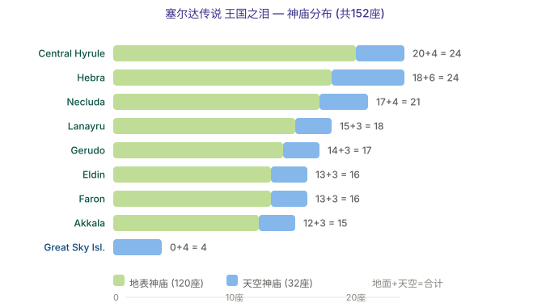

# Zelda: Tears of the Kingdom — All Shrines Guide

> 152 shrines total: **120 on the Surface + 32 in the Sky**

Most shrine lists give you a map and stop. This one keeps our full 152-shrine breakdown verbatim below — but the decision that actually matters isn't *which* shrine to do, it's *what to spend the Lights of Blessing on*. Two full stamina wheels (20 shrines' worth of vessels) is the gate for pulling the Master Sword, and most players waste their first vessels on hearts. We tell you the order, and how to survive the Proving Grounds with the stick you're given.

> **Beginner trap we see constantly:** players grab Heart Containers early because "more HP = safer." But the Master Sword needs 13 hearts *or* you can trade stamina for them — and two stamina wheels (not hearts) are what let you reach it. Hearts can wait; stamina can't.

**Our call:** route Central Hyrule first (35 shrines, highest density), dump vessels into stamina until you have two wheels, *then* think about hearts.

---

## Great Sky Island (4 — Mandatory Tutorial)

| Shrine | Location | Ability |
|--------|----------|---------|
| Ukouh | East Great Sky Island | Ultrahand |
| In-isa | West Great Sky Island | Fuse |
| Gutanbac | North Great Sky Island | Ascend |
| Nachoyah | South Great Sky Island | Recall |

> These 4 shrines are the **only mandatory shrines** in the game. You cannot leave the Great Sky Island without completing them.

---

## Shrine Distribution by Region

| Region | Sky | Surface | Total |
|--------|-----|---------|-------|
| Central Hyrule | 4 | 31 | 35 |
| Hebra | 7 | 17 | 24 |
| Gerudo | 3 | 17 | 20 |
| Necluda | 4 | 14 | 18 |
| Lanayru | 4 | 13 | 17 |
| Eldin | 1 | 14 | 15 |
| Akkala | 3 | 10 | 13 |
| Faron | 2 | 4 | 6 |
| Great Sky Island | - | - | 4 |
| **Total** | **32** | **120** | **152** |

---

## Shrine Types

### Puzzle Shrines
Standard puzzle shrines using the four abilities (Ultrahand, Fuse, Ascend, Recall) to solve challenges.

### Rauru's Blessing
No puzzle inside — just walk in and claim your reward. Usually appears when:
- The challenge was getting to the shrine itself
- After completing a crystal-delivery shrine quest

### Proving Grounds ⭐
**Rules**: All equipment and materials are temporarily removed on entry. You're given basic weapons (Wooden Stick, Old Wooden Bow, Old Wooden Shield + 10 arrows). Defeat all enemies to complete. Equipment is returned afterward.

Notable Proving Grounds shrines:
| Shrine | Location | Type |
|--------|----------|------|
| Joku-usin | Thunderhead Isles (Sky) | Proving Grounds: Short Circuit |
| Yansamin | Zonaite Forge Island (Sky) | Proving Grounds: Low Gravity |
| Kamizun | Surface | Proving Grounds: Beginner |

**Our call:** Proving Grounds look scary but they're a [Fuse tutorial in disguise](/en/zelda/fuse/) — fuse a rock or horn to the Wooden Stick the moment you enter and the "no equipment" rule stops mattering. They're easier than they read.

---

## Recommended Collection Order

### Phase 1: Great Sky Island (Required)
Complete tutorial shrines → obtain Paraglider → leave sky island

### Phase 2: Central Hyrule (Recommended)
Central Hyrule has **35 shrines** (highest density), moderate difficulty, ideal for early exploration
- Prioritize Stamina Vessels over Heart Containers early on
- 2 full Stamina wheels (20 shrines) is the prerequisite for pulling the Master Sword

### Phase 3: Expand Outward
Progress through Hebra → Lanayru → Necluda → Gerudo → Eldin → Akkala → Faron

### Phase 4: Sky Islands Cleanup
The 32 Sky shrines often require vehicle construction. Save them for when you have ample Zonai devices and stamina.

**Our call:** Phase 4 is where your [Hover Bike pays off](/en/zelda/zonai-devices/) — the Sky shrines are unreachable without flight or serious climbing, so don't attempt them until batteries are up.

---

## Shrine Rewards

| Per Shrine | 4 Shrines = |
|------------|-------------|
| Light of Blessing ×1 | Heart Container or Stamina Vessel (1/5 wheel) |
| Treasure Chest ×1 (weapons/armor/Zonaite) | — |

---

## Tips

- **Can't find sky shrines?** Activate Skyview Towers in each region first — they reveal sky island locations on your map.
- **Stuck on Proving Grounds?** Use Fuse to attach strong materials to basic weapons — it dramatically increases damage.
- **The Depths have no shrines** — but they contain 152 Lightroots, each corresponding to a Surface shrine.
- **Crystal delivery quests**: Some shrines require transporting a crystal. Gather Zonai devices beforehand to build vehicles for these.

**Our call:** the Lightroots note is the real pro tip — clearing a Surface shrine and its matching [Depths Lightroot](/en/zelda/depths/) in one trip lights the underground map for free.

---

## Common Shrine Mistakes (and the Fix)

1. **Spending vessels on hearts first.** Fix: two stamina wheels gate the Master Sword; stack stamina to 20 vessels before any heart.
2. **Fear of Proving Grounds.** Fix: Fuse a material to the Wooden Stick on entry — the equipment strip is trivial once you do.
3. **Rushing Sky shrines early.** Fix: they need flight; clear Surface first and build a [Zonai vehicle](/en/zelda/zonai-devices/) before attempting the 32 sky ones.
4. **Ignoring crystal-delivery quests.** Fix: pre-build a cart so the transport puzzle is a drive, not a slog.

---

## FAQ

**How many shrines are there, and do I need them all?** 152 total (120 Surface + 32 Sky). You need 20 for two stamina wheels and ~40–45 to comfortably pull and wield the Master Sword; the rest are optional upgrades.

**Why prioritize stamina over hearts?** The Master Sword requires 13 hearts *or* a stamina trade, and two wheels make traversal (climbing, gliding, floating) dramatically easier. Hearts you can fake with [cooked meals](/en/zelda/cooking/).

**Are the Sky shrines harder?** Not puzzle-wise — they're often simpler — but they're physically hard to reach without flight. Build a Hover Bike first.

**What's the reward per shrine?** One Light of Blessing (toward a Heart Container or 1/5 Stamina Vessel) plus a treasure chest with weapons, armor, or Zonaite.

**Where do I go after shrines?** With stamina sorted, go get the [Master Sword via Fuse weapons](/en/zelda/weapons/) and start [Korok capacity farming](/en/zelda/korok-seeds/).

---

*Last updated for Tears of the Kingdom Ver.1.4.3 (Switch 2 Edition era). All 152-shrine, regional, reward, and tip data above are reproduced from our master guide; added commentary reflects in-game shrine/stamina mechanics, not changed numbers.*
